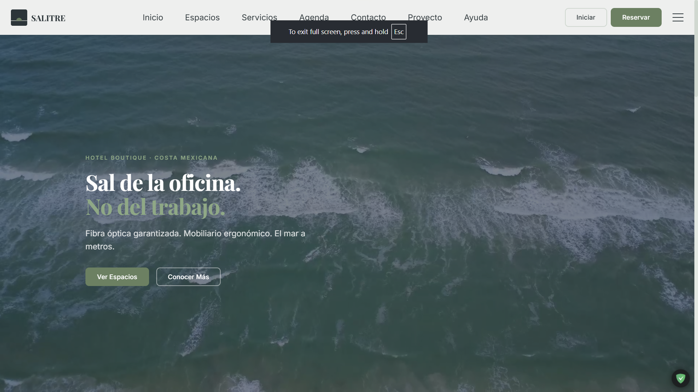
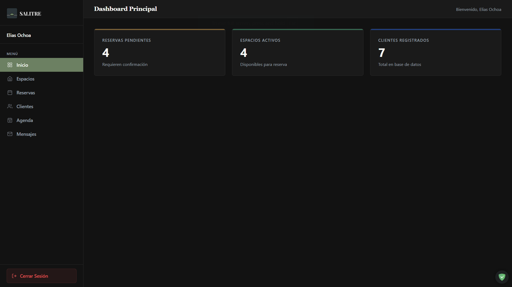

# SalitreApp

**Salitre - Hotel para Nómadas Digitales**  
_"Sal de la oficina. No del trabajo."_

Plataforma web de reservas para un hotel boutique orientado a nómadas digitales.
Incluye un sitio público para clientes y un panel de administración para el equipo del hotel.

---

## Tabla de contenidos

- [Descripción](#descripción)
- [Stack](#stack)
- [Funcionalidades](#funcionalidades)
- [Estructura del proyecto](#estructura-del-proyecto)
- [Requisitos](#requisitos)
- [Instalación y configuración](#instalación-y-configuración)
- [Credenciales de prueba](#credenciales-de-prueba)
- [Notas técnicas](#notas-técnicas)
- [Limitaciones conocidas](#limitaciones-conocidas)

---

## Descripción

SalitreApp es una aplicación web de reservas construida con PHP nativo, MySQL y
JavaScript vanilla — sin frameworks, sin gestor de paquetes, sin dependencias
de terceros más allá de Google Fonts.

El proyecto tiene dos módulos diferenciados:

- **Sitio cliente**: navegación de espacios, flujo de reserva con carrito,
  autenticación, historial personal, agenda de eventos y formulario de contacto.
- **Panel admin**: gestión completa de espacios, reservas, clientes, eventos
  y mensajes de contacto. Acceso restringido por sesión.



---

## Stack

| Capa                 | Tecnología                              |
| -------------------- | --------------------------------------- |
| Backend              | PHP 8.2+ nativo, sin framework          |
| Base de datos        | MySQL / MariaDB vía PDO                 |
| Frontend             | HTML5, CSS3, JavaScript ES2015+         |
| Tipografía           | Google Fonts — Playfair Display + Inter |
| Servidor local       | XAMPP (Apache + MySQL)                  |
| Control de versiones | Git                                     |

---

## Funcionalidades

### Módulo cliente

| Funcionalidad                    | Estado          |
| -------------------------------- | --------------- |
| Catálogo de espacios             | Implementado    |
| Detalle de espacio con galería   | Implementado    |
| Carrito y flujo de reserva       | Implementado    |
| Registro y login                 | Implementado    |
| Perfil con historial de reservas | Implementado    |
| Agenda de eventos                | Implementado    |
| Formulario de contacto           | Implementado    |
| Páginas estáticas                | Implementado    |
| Cancelación de reserva propia    | No implementada |
| Recuperación de contraseña       | No implementada |

### Panel de administración

| Funcionalidad                       | Estado                      |
| ----------------------------------- | --------------------------- |
| Dashboard con estadísticas          | Implementado                |
| CRUD de espacios con imagen         | Implementado                |
| Listado y actualización de reservas | Implementado                |
| Listado de clientes                 | Implementado (solo lectura) |
| CRUD de eventos                     | Implementado                |
| Mensajes de contacto                | Implementado                |
| Paginación en listados              | Implementado                |
| Gestión de staff                    | Solo vía SQL                |
| Pasarela de pago                    | No implementada             |



---

## Estructura del proyecto

```
salitre/
├── admin/                  # Panel de administración
│   ├── includes/           # Parciales compartidos
│   ├── espacios/           # CRUD de espacios
│   ├── reservas/           # Listado y detalle de reservas
│   ├── clientes/           # Listado de clientes
│   ├── eventos/            # CRUD de eventos
│   └── contacto/           # Mensajes de contacto
├── client/                 # Sitio público
│   ├── includes/           # Parciales compartidos
│   ├── auth/               # Login, registro, perfil, logout
│   ├── carrito/            # Carrito y procesamiento de reserva
│   ├── espacios/           # Catálogo y detalle
│   ├── agenda/             # Eventos
│   ├── contacto/           # Formulario de contacto
│   ├── servicios/          # Página estática
│   ├── proyecto/           # Página estática "Nosotros"
│   └── ayuda/              # Página estática FAQ
├── assets/
│   ├── css/                # Hojas de estilo
│   ├── js/                 # Scripts
│   └── img/                # Imágenes del proyecto e imágenes subidas
├── config/
│   ├── constants.php       # Constantes globales
│   └── database.php        # Conexión PDO
└── database/
    ├── setup.sql           # DDL completo + datos de prueba
    └── migrations/         # Alteraciones posteriores al esquema inicial
```

Cada módulo tiene un controlador que maneja datos y sesión,
y una plantilla que solo renderiza HTML.
Los controladores nunca mezclan lógica con presentación.

---

## Requisitos

- XAMPP con PHP 8.2 o superior y MySQL/MariaDB
- Navegador moderno (Chrome, Firefox, Edge, Safari - versiones actuales)
- Git

No se requiere ninguna herramienta de build.

---

## Instalación y configuración

### 1. Clonar el repositorio

```bash
git clone https://github.com/Ochoa-Stack/SalitreApp.git
```

Coloca la carpeta clonada dentro del directorio `htdocs` de XAMPP:

```
C:/xampp/htdocs/salitre/   <- Windows
/Applications/XAMPP/htdocs/salitre/   <- macOS
```

### 2. Crear la base de datos

1. Abre XAMPP y levanta los servicios **Apache** y **MySQL**.
2. Navega a `http://localhost/phpmyadmin`.
3. Crea una base de datos nueva llamada `salitre_db` con cotejamiento `utf8mb4_unicode_ci`.
4. Selecciona esa base de datos, ve a la pestaña **Importar** y carga el archivo:
   ```
   database/setup.sql
   ```
5. Si existen archivos en `database/migrations/`, impórtalos en orden alfabético
   después del `setup.sql`.

### 3. Verificar configuración

Revisa `config/database.php`. Los valores por defecto están listos para XAMPP estándar:

```php
$host     = 'localhost';
$dbname   = 'salitre_db';
$username = 'root';
$password = '';
```

Ajusta si tu instalación de XAMPP usa credenciales distintas.

Revisa `config/constants.php` y confirma que `BASE_URL` apunta a tu ruta local:

```php
define('BASE_URL', 'http://localhost/salitre/');
```

### 4. Verificar directorio de uploads

Confirma que el directorio de imágenes subidas existe y tiene permisos de escritura:

```
assets/img/client/espacios/
```

En Linux/macOS:

```bash
chmod 755 assets/img/client/espacios/
```

### 5. Acceder al proyecto

| Módulo        | URL                               |
| ------------- | --------------------------------- |
| Sitio cliente | `http://localhost/salitre/`       |
| Panel admin   | `http://localhost/salitre/admin/` |

---

## Credenciales de prueba

Estas credenciales están incluidas en el archivo `setup.sql`.

**Administrador**

| Campo      | Valor               |
| ---------- | ------------------- |
| Usuario    | `admin@salitre.com` |
| Contraseña | `Admin1234`         |

**Cliente de prueba**

| Campo      | Valor                 |
| ---------- | --------------------- |
| Usuario    | `cliente@ejemplo.com` |
| Contraseña | `Cliente1234`         |

---

## Notas técnicas

**Seguridad**

- Protección CSRF con Synchronizer Token Pattern en todos los formularios mutantes.
- Contraseñas almacenadas con bcrypt (`password_hash` / `password_verify`).
- Queries con PDO y prepared statements en toda la capa de datos.
- Acceso directo bloqueado a `includes/` y `config/` vía `.htaccess`.
- El total de una reserva se recalcula desde la base de datos al procesar el pago, ignorando el valor en sesión.

**CSS**

- `assets/css/shared/variables.css`contiene la escala tipográfica, colores semánticos, espaciado, radios, sombras y transiciones.
- El admin tiene su propio conjunto de variables en `assets/css/admin/variables.css` con tema oscuro, heredando el color de acento del sitio cliente.

**Tipografía externa**

- Google Fonts es la única dependencia externa.
  Si no está disponible, el sitio cae a `Georgia, serif` y `system-ui, sans-serif` - configurado en el fallback del CSS.

**Imágenes de espacios**

- Las imágenes que vienen con el proyecto son WebP, ubicadas en `assets/img/`.
- Las imágenes subidas desde el panel admin se guardan en `assets/img/client/espacios/` y se sirven desde esa misma ruta. Solo se aceptan JPEG, PNG y WebP.

---

## Limitaciones conocidas

- Los íconos de Visa, Mastercard, AMEX, PayPal y OXXO son decorativos. No hay integración de cobro real.
- El flujo de "olvidé mi contraseña" no está implementado. Un usuario que pierde su contraseña no puede recuperarla desde la UI.
- Un cliente puede ver sus reservas pero no cancelarlas. La cancelación solo puede hacerla un administrador desde el panel.
- Los usuarios administradores solo pueden crearse directamente en la base de datos vía SQL. No hay interfaz para ello.
- Los listados del admin están paginados a 20 registros por página, pero no tienen campo de búsqueda ni filtros.
- `config/database.php` usa `root`sin contraseña - configuración estándar de XAMPP, no apta para despliegue en producción.
