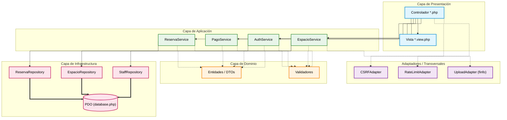

# Salitre

[](https://github.com/Ochoa-Stack/Salitre/actions/workflows/ci.yml)
[](https://www.php.net/)
[](https://mariadb.org/)
[](https://opensource.org/licenses/MIT)

> Plataforma de reservas end-to-end para hoteles boutique.
> Portal de clientes + panel de administración.
> PHP 8.2+ puro · MariaDB · JavaScript vanilla · **Cero dependencias en runtime**.

---

## Propósito

Salitre resuelve la gestión integral de reservas para hoteles boutique que necesitan:

- Un **portal público** donde los clientes exploren espacios, armen carritos y paguen.
- Un **panel administrativo** donde el personal gestione inventario, vea ocupación y procese reservas.
- **Trazabilidad completa** de datos para futuros modelos predictivos de ocupación y pricing.

**Diferenciadores técnicos:**

- **Cero dependencias en runtime**: la aplicación en producción corre íntegramente con PHP nativo y PDO. Composer solo se usa para herramientas de calidad (PHPStan, PHPCS, PHPUnit), nunca en el contenedor de producción.
- **Seguridad por diseño**: CSRF centralizado, regeneración de sesión, tipado fuerte, hardening de Nginx.
- **Preparación para Data Science**: CDC con `updated_at`, vistas analíticas con CTE recursivos, normalización para one-hot encoding.

---

## Arquitectura

Salitre sigue el patrón **MVC con Servicios y Repositorios** (documentado en [ADR-001](docs/adr/001-mvc-con-servicios.md)).



**Principios arquitectónicos:**

- **Separación estricta**: controladores delgados (< 50 líneas), servicios con lógica de negocio, repositories con queries PDO.
- **Sin SELECT \***: todas las queries seleccionan columnas explícitas para reducir overhead de memoria.
- **Helpers centralizados**: lógica financiera y de validación en funciones reutilizables (DRY).
- **Vistas puras**: solo renderizan HTML, nunca ejecutan lógica de negocio.

---

## Seguridad

Salitre implementa defensa en profundidad contra las vulnerabilidades más comunes (OWASP Top 10):

### Autenticación y sesión

- **Contraseñas**: `password_hash()` con bcrypt + `password_verify()`.
- **Regeneración de ID**: `session_regenerate_id(true)` en cada cambio de contexto (login/logout).
- **Casteo explícito**: todos los datos de sesión se convierten explícitamente a los tipos esperados en `$_SESSION`.

### Protección contra inyección

- **PDO con prepared statements**: `ATTR_EMULATE_PREPARES => false` para forzar prepared statements reales.
- **Parámetros nombrados**: nunca concatenación de strings en queries.
- **Escape sistemático**: todas las salidas HTML usan `htmlspecialchars($var, ENT_QUOTES, 'UTF-8')`.

### CSRF y validación

- **Tokens efímeros**: generados con `bin2hex(random_bytes(32))`, validados con `hash_equals()` (timing-safe).
- **Helper centralizado**: `config/csrf.php` expone `generarTokenCSRF()` y `validarTokenCSRF()`.
- **Uploads seguros**: validación MIME real con `finfo_file()`, no confianza en extensiones.

### Hardening de infraestructura

- **Nginx**: bloquea acceso a `/config/`, `/admin/includes/`, `/client/includes/`, y archivos sensibles (`.sql`, `.env`, `.git`).
- **Cabeceras de seguridad**: CSP, X-Frame-Options, X-Content-Type-Options (implementación en progreso).
- **Rate limiting**: contador en sesión con ventana deslizante en endpoints de autenticación (implementación en progreso).

---

## Data Engineering

Salitre está diseñado para integrarse nativamente con pipelines de Data Science y Machine Learning:

### Change Data Capture (CDC)

- Tablas `espacios` y `reservas` incluyen columna `updated_at` con `ON UPDATE CURRENT_TIMESTAMP`.
- Permite rastrear mutaciones sin triggers ni lógica adicional.

### Normalización para One-Hot Encoding

- Tabla puente `espacio_amenidades` separa características categóricas (amenidades) de la tabla principal.
- Facilita generación de features binarias para modelos predictivos.

### Series de tiempo continuas

- Vista analítica `v_ocupacion_diaria` construida con CTE recursivo que genera una cuadrícula de 365 días.
- Elimina sesgo de supervivencia: días sin reservas aparecen con ocupación 0, no con datos faltantes.
- Lista para alimentar modelos de forecasting de ocupación y pricing dinámico.

---

## Calidad de código

Pipeline de análisis estático y pruebas (excluido del contenedor de producción):

```bash
# Instalar herramientas de desarrollo
composer install

# Ejecutar suite completa (PHPStan + PHPCS + PHPUnit)
composer run check
```

**Estándares aplicados:**

- **PHPStan nivel 6+**: análisis estático estricto.
- **PHPCS con PSR-12**: estilo de código consistente.
- **PHPUnit**: pruebas unitarias e integración (cobertura objetivo: ≥ 70% en servicios).
- **`strict_types=1`**: obligatorio en todos los archivos PHP.

---

## Estructura del proyecto

```
Salitre/
├── admin/                  # Panel administrativo (Módulos: espacios, reservas, eventos, clientes, contacto)
│   ├── includes/           # Helpers, auth_check, header, footer, sidebar
│   └── [módulos]/          # Cada módulo tiene *.php (controlador) + *.view.php (vista)
├── client/                 # Portal público (Módulos: agenda, auth, carrito, espacios, servicios, contacto)
│   ├── includes/           # Helpers, header, footer, nav, pricing
│   └── [módulos]/
├── assets/
│   ├── css/                # admin/, client/, shared/
│   ├── js/                 # admin/, client/, shared/
│   └── img/, video/
├── config/                 # database.php, constants.php, csrf.php, .htaccess
├── database/
│   ├── setup.sql           # Esquema completo + seed
│   └── migrations/         # Migraciones incrementales
├── docs/
│   └── adr/                # Architecture Decision Records
├── tests/                  # PHPUnit
├── Dockerfile              # PHP 8.2-FPM + Nginx
├── docker-compose.yml      # app + mariadb + phpmyadmin
├── composer.json           # require: {} (vacío) | require-dev: phpstan, phpcs, phpunit
└── .github/workflows/      # CI con GitHub Actions
```

---

## Inicio rápido

### Prerrequisitos

- Docker & Docker Compose
- Git

### Instalación

```bash
# 1. Clonar repositorio
git clone https://github.com/Ochoa-Stack/Salitre.git
cd Salitre

# 2. Copiar archivo de entorno
cp .env.example .env

# 3. Levantar servicios
docker-compose up -d
```

MariaDB se inicializa automáticamente y ejecuta las migraciones desde `/database`.

### Acceso a servicios

| Servicio       | URL                            |
| -------------- | ------------------------------ |
| Portal Cliente | `http://localhost:8080/`       |
| Panel Admin    | `http://localhost:8080/admin/` |
| PHPMyAdmin     | `http://localhost:8081/`       |

### Credenciales de prueba

| Rol     | Email               | Contraseña                          |
| ------- | ------------------- | ----------------------------------- |
| Admin   | `admin@salitre.mx`  | _(ver tabla `staff` en PHPMyAdmin)_ |
| Cliente | `cliente@prueba.mx` | `cliente123`                        |

---

## Documentación

- **[CONTRIBUTING.md](CONTRIBUTING.md)**: Flujo de ramas, Conventional Commits, configuración de entorno.
- **[SECURITY.md](SECURITY.md)**: Política de reporte de vulnerabilidades y prácticas de seguridad.
- **[CHANGELOG.md](CHANGELOG.md)**: Historial de cambios siguiendo "Keep a Changelog".
- **[docs/adr/](docs/adr/)**: Registros de decisiones arquitectónicas.
- **[DEPLOY_GUIDE.md](DEPLOY_GUIDE.md)**: Guía detallada de despliegue en producción.

---

## Contribución

Este es un proyecto de portafolio individual, pero las contribuciones son bienvenidas. Lee [CONTRIBUTING.md](CONTRIBUTING.md) para entender el flujo de trabajo, convenciones de commits y estándares de código.

---

## Licencia

Distribuido bajo la Licencia MIT. Consulta [LICENSE](LICENSE) para más detalles.

---

**Desarrollado y construido por Elías Ochoa.**
